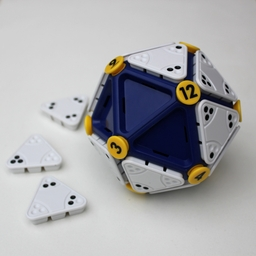
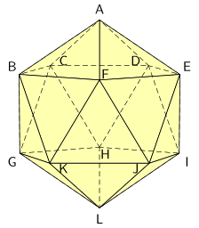
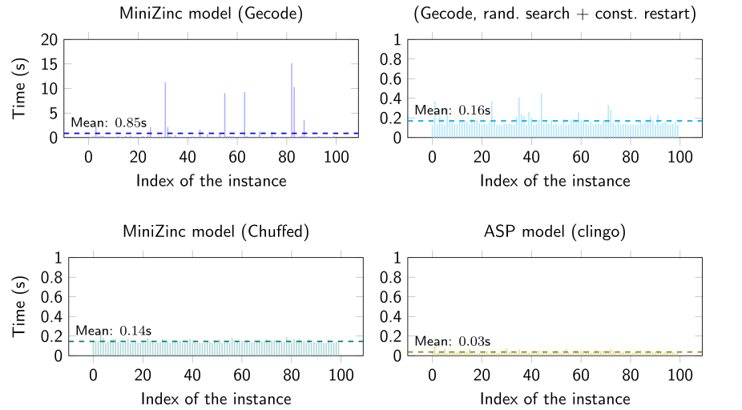
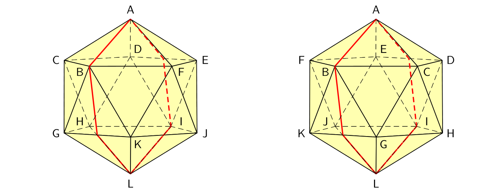

# 3coSoKu
MiniZinc and Answer Set Programming solvers for IcoSoKu and its NP-complete generalization 3coSoKu.



## The problem
[IcoSoKu](https://www.recenttoys.com/recent-toys-icosoku-puzzle-p/) (seen in the figure on the right) is a mechanical puzzle created in 2009 by Andrea Mainini and it works like this: first, place the 12 yellow pegs (the numbers from 1 to 12) arbitrarily on the vertices; then, find an arrangement of the 20 triangular tiles shipping with the game on the faces of the icosahedron, such that the number of black dots surrounding each vertex is equal to its number of the yellow peg.

**3coSoKu** is the generalization of IcoSoKu that accepts in input:
* the *playing field*, a polyhedron with *triangular* faces (the icosahedron, for IcoSoKu);
* the *capacity* of each vertex, a non-negative integer (the disposition of the yellow pegs);
* the *tiles*, made of three non-negative integer weights (the tiles with their dots).

To stay true to IcoSoKu, we impose the number of tiles to be equal to the number of faces. 3coSoKu is NP-complete, but the NP-completeness if we impose the playing field to be a deltahedron is an open problem, you can read all the details in this paper (link to be soon added) that my professor and I wrote.

## Getting started
Install [MiniZinc](https://www.minizinc.org/) and/or [clingo](https://potassco.org/), then download this repository.
```shell
git clone https://github.com/nrizzo/3coSoKu.git
cd 3coSoKu
```



The solvers, found in `solvers/MiniZinc` and `solvers/ASP`, are already configured to solve instances of IcoSoKu. On Linux/Unix systems you can use the script `icosolve.sh`, found in both folders: the script accepts as input the twelve capacities specifying the yellow pegs, following the convention of the figure on the right (alphabetical order).
```shell
cd solvers/MiniZinc
./icosolve.sh 1 2 3 4 5 6 7 8 9 10 11 12
```
Alternatively, you can modify the array `cap` in file `input-ico.dzn` and facts `cap` in `input-ico.lp` respectively, also following the convention of the figure on the right, and manually execute the solvers:
```shell
minizinc --solver chuffed 3coSoKu.mzn input-ico.dzn
```
for MiniZinc (you can also use the IDE), and
```shell
clingo 3coSoKu.lp variants/ico.lp input-ico.lp
```
for ASP.

## Experimental results
Folder `tests` contains the Bash scripts to perform two interesting tests, also described in the paper (link to be soon added):
1. `run_tests.sh` measures the performance of various solvers on a batch on 100 instances of IcoSoKu; on my machine, an Intel i5-7400 @ 3.20 GHz, it generates the times seen below;

in the context of the MiniZinc model, the comparison between Gecode's standard search and Gecode's randomized search highlights an interesting aspect of IcoSoKu, that is the presence of many solutions (billions!) to each instance and this might imply a randomized search with *frequent* restarts to be effective in solving IcoSoKu by hand;
2. `test_all_instances.sh` uses the ASP model to check the claim that every instance of IcoSoKu can be solved by solving only 4M of them, thanks to some symmetries of the game:
	- we can impose vertex A to have capacity 1 (the icosahedron can be rotated);
	- we can impose vertex B to have capacity less than C, D, E and F (the icosahedron can still be rotated on its A-L axis);
	- since the tile configuration of IcoSoKu stays the same if looked through a mirror, we need to solve only one between each instance and its mirrored version (the icosahedron is symmetric w.r.t. the plane that goes through vertices A, B and L).

  using [GNU **parallel**](http://www.gnu.org/software/parallel/), my machine executed this task successfully in 16 hours (using 4 threads), verifying the claim.

## Future development
A program visualizing 3D instances and solutions of IcoSoKu is planned.

## Acknowledgments
Many thanks to my professor Agostino Dovier for the proposal of this problem and for writing the paper with me, to Marzio De Biasi for his kind words, to the organizers of [CILC 2020](https://cilc2020.demacs.unical.it/), to their reviewers and to its attendees.
