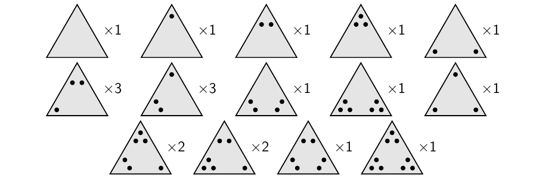
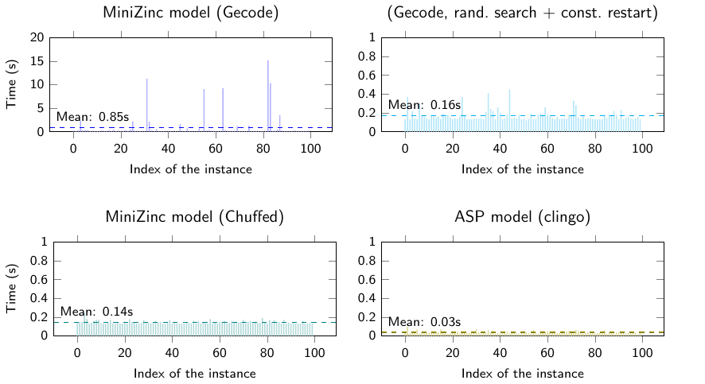

# 3coSoKu
[MiniZinc](https://www.minizinc.org/) and [Answer Set Programming](https://potassco.org/) solvers for IcoSoKu and its strongly NP-complete generalization 3coSoKu, completed by a 3D visualisation/solver tool for IcoSoKu built with [Three.js](https://threejs.org/) and [clingo-wasm](https://github.com/domoritz/clingo-wasm), that [you can try online](https://nrizzo.github.io/3coSoKu/). This repository also contains the scripts benchmarking the solvers and verifying that every instance of IcoSoKu can indeed be solved (see **Experimental results**).


## The problem
[IcoSoKu](https://en.wikipedia.org/wiki/Icosoku) is a mechanical puzzle created in 2009 by Andrea Mainini and it works as follows:

1. the game is setup by placing the 12 yellow pegs (the numbers from 1 to 12) arbitrarily on the vertices;
2. the game is played by finding an arrangement of the 20 triangular tiles shipping with the game on the faces of the icosahedron, such that the number of black dots surrounding each vertex is equal to its number of the yellow peg.

The 20 tiles are shown below.



**3coSoKu** is the generalization of IcoSoKu where each instance is defined by:
* the *playing field*, a polyhedron with *triangular* faces (the icosahedron, for IcoSoKu);
* the *capacity* of each vertex, a non-negative integer (the disposition of the yellow pegs);
* the *tiles*, made of three non-negative integer weights (the tiles with their dots).

To stay true to IcoSoKu, we impose the number of tiles to be equal to the number of faces. 3coSoKu is strongly NP-complete, you can read all the details in [this paper](http://ceur-ws.org/Vol-2710/paper1.pdf) that Agostino Dovier, my professor at the University of Udine, and I wrote.

## Getting started
To see IcoSoKu instances and to solve them using the ASP solver you can try and play around with [the web application](https://nrizzo.github.io/3coSoKu/): no installation is required, thanks to Three.js and to clingo compiled to WebAssembly.

Otherwise, if you want to test the solvers, install [MiniZinc](https://www.minizinc.org/) and/or [clingo](https://potassco.org/), then download this repository.
```shell
$ git clone https://github.com/nrizzo/3coSoKu.git
$ cd 3coSoKu
```


The solvers, found in `solvers/MiniZinc` and `solvers/ASP`, are already configured to solve instances of IcoSoKu. On Linux/Unix systems you can use the script `icosolve.sh`, found in both folders: the script accepts as input the twelve capacities specifying the yellow pegs, following the convention of the figure on the right (alphabetical order).
```shell
$ cd solvers/MiniZinc
$ ./icosolve.sh 1 2 3 4 5 6 7 8 9 10 11 12
```
Alternatively, you can modify the array `cap` in file `input-ico.dzn` and facts `cap(V,C)` in `input-ico.lp`, respectively, also following the convention of the figure on the right, and manually execute the solvers:
```shell
$ minizinc --solver chuffed 3coSoKu.mzn input-ico.dzn
```
for MiniZinc (you can also use the IDE), and
```shell
$ clingo 3coSoKu.lp variants/ico.lp input-ico.lp
```
for ASP.

## Experimental results
Folder `tests` contains the Bash scripts to perform two interesting tests, also described in the [paper](http://ceur-ws.org/Vol-2710/paper1.pdf):
1. `run_tests.sh` measures the performance of the various solvers on a batch on 100 instances of IcoSoKu; on my machine, an Intel i5-7400 @ 3.20 GHz, it generates the times seen below.

Gecode's tests highlight an interesting aspect of IcoSoKu: there seem to be a great number of different solutions (billions!) to each instance of the game, thus a randomized search with *frequent* restarts is effective in solving IcoSoKu with Gecode (and also by hand). An even better strategy is using some sort of *learning*, as is shown by the other tests. 
2. `test_all_instances.sh` uses the ASP model to check the claim that every instance of IcoSoKu can be solved by solving only 4M of them, thanks to some symmetries of the game:
	- we can impose vertex A to have capacity 1 (the icosahedron can be rotated);
	- we can impose vertex B to have capacity less than C, D, E and F (the icosahedron can still be rotated on its A-L axis);
	- since the tile configuration of IcoSoKu stays the same if looked through a mirror, we need to solve only one between each instance and its mirrored version (the icosahedron is symmetric w.r.t. the plane that goes through vertices A, B and L).


Using [GNU **parallel**](http://www.gnu.org/software/parallel/), my machine executed `test_all_instances.sh` successfully in 16 hours (using 4 threads), effectively solving every instance of IcoSoKu and thus verifying the claim of the game.

## The 3D visualisation tool
We developed a 3D application visualising IcoSoKu instances and its solutions using [`three.js`](https://github.com/mrdoob/three.js/), [`Tweakpane`](https://github.com/cocopon/tweakpane), and [`stats.js`](https://github.com/mrdoob/stats.js/). Moreover, the application uses [`clingo-wasm`](https://github.com/domoritz/clingo-wasm) to actually solve (in-browser!) the IcoSoKu instance specified by the user, thanks to clingo compiled to WebAssembly and our ASP encoding.

You can [try here](https://nrizzo.github.io/3coSoKu/) the web application using any modern browser, or you can launch it locally in two ways:
* you can host the folder `webapp/http` on your local network with any HTTP server;

        $ cd webapp/http
        $ python3 -m http.server &
        $ firefox localhost:8000

* you can run the offline version of the application found in `webapp/offline` without doing any hosting by opening the main html file.

        $ firefox webapp/offline/index.html

The offline version in `webapp/offline` does not trigger the browser's CORS rules and it was obtained with some tricks, among which compiling clingo to JavaScript instead of WebAssembly using `empscripten`'s options `-s WASM=0 --memory-init-file 0` (resulting in poorer clingo performance).

## License
All of my code (the solver, the scripts and the webapp) is licensed under the terms of the GNU GPL v3 license, whereas the software and assets I am using (located in `webapp/{http,offline}/vendor` and in `webapp/{http,offline}/assets`), that is [Clingo WebAssembly](https://github.com/domoritz/clingo-wasm), [three.js](https://github.com/mrdoob/three.js/), [Tweakpane](https://github.com/cocopon/tweakpane), and [stats.js](https://github.com/mrdoob/stats.js), keep their original license. My images (in the `images` folder) are instead licensed under CC BY.

## Acknowledgments
Many thanks to my professor Agostino Dovier for the proposal of this problem and for writing the paper with me, to Marzio De Biasi for his kind words, to the organizers of [CILC 2020](https://cilc2020.demacs.unical.it/), to their reviewers and to its attendees.
