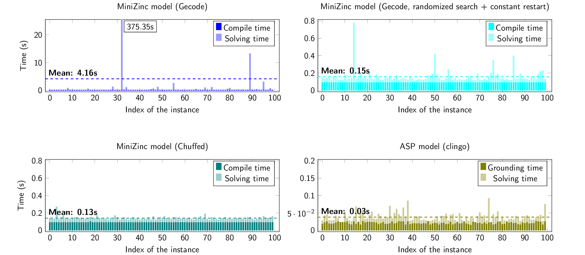
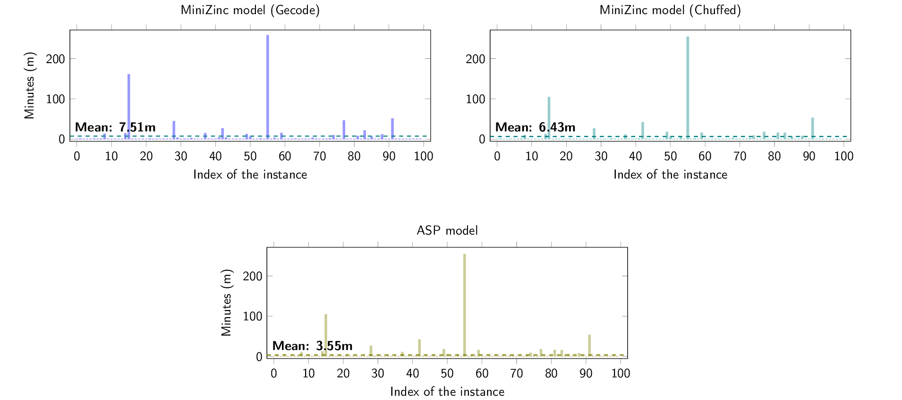
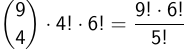

# Experimental tests for 3coSoKu
This folder contains the scripts for three tests challenging our encodings for IcoSoKu and 3coSoKu:
1. `icosoku100`, comparing the performance of our solvers on 100 pseudo-random instances of IcoSoKu;
2. `icosoku`, solving every possible IcoSoKu instance (or, more specifically, the 3991680 instances obtained after removing symmetric instances and solutions);
3. `unsat-icosoku100`, comparing the performance of our solvers on 100 pseudo-random instances of 4-unsat-IcoSoKu, an unsatisfiable variant of IcoSoKu that we developed.

The results, described below, were obtained on a desktop computer running a clean installation of Ubuntu Server 20.04.3 and having the following characteristics:

| Component                 | Component type | Details                |
|---------------------------|----------------|------------------------|
| ASrock H170M Pro4S        | Motherboard    |                        |
| Intel i5-7400             | CPU            | @ 3.50 GHz w/ cpupower |
| HyperX Fury HX424C15FB2/8 | RAM            | 2x8                    |
| Kingston A400             | SSD            |                        |

Also, the version of the main software used is described below:

| Software              | Description                                 | Version      |
|-----------------------|---------------------------------------------|--------------|
| MiniZinc Distribution | MiniZinc compiler and FlatZinc solvers      | 2.4.2        |
| clingo                | Answer Set System                           | 5.4.0        |
| OpenSSL               | Algorithms for test generation              | 1.1.1f       |
| GNU parallel          | Shell tool to execute jobs in parallel      | 20161222-1.1 |

## icosoku100
The script `icosoku100/runtest.sh` generates a batch of 100 random instances of IcoSoKu and measures the performance of the following solvers on these instances:
 * Gecode on our MiniZinc model;
 * Chuffed on our MiniZinc model;
 * Gecode on our MiniZinc model, under a randomized search with a restart after a constant number of nodes visited;
 * clingo on our ASP model.
For the MiniZinc models, the solving time and the compilation time are reported for each instance and for the ASP models the total solving time and the grounding time are reported. The batch and the times are then saved in folder `icosoku100/output_icosoku100`.

### Generating the instances
The batch of 100 pseudo-random IcoSoKu instances is created starting from a seed and using `openssl` as `shuf`'s pseudo-random source, in a similar manner as in the [GNU docs on sources of random data](https://www.gnu.org/software/coreutils/manual/html_node/Random-sources.html).
```
get_random_data()
{
	openssl enc -aes-256-ctr \
		-pass pass:"tetrahedron" \
		-nosalt \
		</dev/zero 2>/dev/null
}

get_random_data | for ((i = 1; i <= 100; i++))
do
	shuf -i1-12 --random-source=/dev/stdin | \
		tr "\n" " " >> output_icosoku100/batch
	echo >> output_icosoku100/batch
done
```
The use of a Unix pipe makes it possible to use the same stream of pseudo-random data (the output of function `get_random_data()`) for multiple calls of `shuf`.

### Results

The test results highlight some interesting properties of IcoSoKu:
- standard search strategies can explore a lot of incorrect solutions before arriving at a correct one, whereas the lazy clause generation of clingo for the ASP model is an effective solving tool;
- a randomized search strategy with frequent restarts also solves IcoSoKu consistently, and this is because there are millions (!) of correct solutions to each instance.

## unsat-icosoku100
We define the k-unsat-icosoku100 problem as follows: the game is defined just as IcoSoKu, but one of the 12 capacities is decremented by 1 and k tiles are placed on k icosahedron faces, without specifying their rotation. The script `unsat-icosoku100/runtest.sh` generates a batch of 100 random instances of 4-unsat-IcoSoKu and measures the performance of the following solvers on these instances:
 * Gecode on our MiniZinc model;
 * Chuffed on our MiniZinc model;
 * clingo on our ASP model.

The total solving time is reported. The batch and the times are then saved in folder `unsat-icosoku100/output_unsat_icosoku100`.

### Generating the instances
The random instances of 4-unsat-IcoSoKu are created in the same manner as for the random IcoSoKu ones.

### Results

The test results highlight the fact that the search space of IcoSoKu (the number of possible solutions) is orders of magnitude bigger than the instance space (the number of possible arrangements of the capacities). This is why standard solving strategies have variable effectiveness for IcoSoKu instances.

## icosoku
The script `icosoku/runtest.sh` uses the ASP model to check the claim that every instance of IcoSoKu can be solved by solving only 4M of them, thanks to some symmetries of the game:
1. we can impose vertex A to have capacity 1, because the icosahedron can be freely rotated;
2. we can impose vertex B to have capacity less than C, D, E, and F, because the icosahedron can still be rotated on its A-L axis;
3. since the set of 20 IcoSoKu tiles stays the same if mirrored horizontally, we need to solve only one between each instance and its mirrored version, because the icosahedron is symmetric w.r.t. the plane that goes through vertices A, B and L).


Points 1. and 2. leave for the capacity of B any value in {2, ..., 8}:
- if we choose capacity 2 for B, then any assignment of the remaining 10 capacities to vertices C to L is valid, so 10! instances;
- if we choose capacity 3 for B, we can pick for C, D, E, and F four out of the nine capacities greater than 3, we can assign them to C, D, E, and F (a permutation), and we can assign the remaining capacities to the other vertices, so the number of these instances is



- the other choices for the capacity of B can be computed as in the last case.

Thus, the number of instances of IcoSoKu to solve is 3991680: thanks to GNU parallel, `icosoku/runtest.sh` runs a program generating these instances (`icosoku/good_instances.c`); then, it uses a stripped version of the ASP solver (`icosoku/strippedASP`) to solve all the instances, saving the solutions in `icosoku/output_icosoku`; finally, it verifies (again with GNU parallel) each instance-solution pair both with the MiniZinc model and the hand-written Bash script (found in `tools`).

### Results
Using four threads, my machine found a solution to each IcoSoKu instance in 18 hours, 29 minutes and 31 seconds. These solutions were checked with the MiniZinc model and with the Bash script in under 17 hours and 2 hours, respectively.
